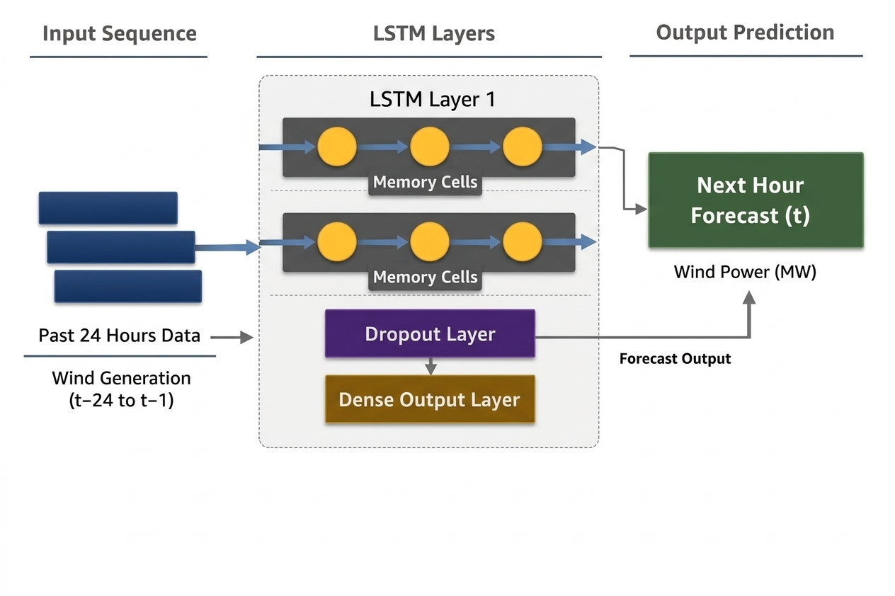

<div align="center">


### 🌬️ Predicting Germany's Hourly Wind Energy Output with LSTM Neural Networks

<br/>


<br/>

*A univariate LSTM network trained on ~50,000 hourly observations to forecast wind power generation in Germany.*

</div>

---

## ⚡ Project Overview


Accurate forecasting of wind energy output is critical for power grid stability and the efficient integration of renewable energy. This project implements a **Long Short-Term Memory (LSTM)** network to predict hourly wind power generation in Germany using real-world data from Open Power System Data.

LSTM networks are especially suited for this task due to their ability to learn **long-term temporal dependencies** in sequential data — outperforming traditional models like MLP and CNN for time-series forecasting.

```python
project = {
    "task":       "Time-series forecasting",
    "target":     "Hourly wind power generation (MW)",
    "country":    "Germany 🇩🇪",
    "model":      "LSTM (50 units + Dropout)",
    "data_points": "~50,000 hourly observations",
    "R2_score":   0.9956
}
```

---

## 🗂️ Repository Structure

```
📦 lstm-wind-forecasting
 ┣ 📓 final_project_deep.ipynb          — Full training, evaluation & visualisation notebook
 ┣ 🖼️  lstm_architecture.png            — LSTM model architecture diagram
 ┣ 📊 time_series_60min_singleindex.csv — Dataset (Germany wind generation)
 ┗ 📖 README.md
```

> 📦 The trained `.keras` model and scaler are hosted externally — see **Downloads** below.

---

## 📦 Downloads

| Resource | Link |
|----------|------|
| 🌐 Open Power System Dataset (CSV) | [data.open-power-system-data.org](https://data.open-power-system-data.org/time_series/2020-10-06/time_series_60min_singleindex.csv) |
| 🤖 Trained Model (`lstm_wind_model.keras`) | [huggingface.co/pradnyabhakare829/lstm_wind_model](https://huggingface.co/pradnyabhakare829/lstm_wind_model) |

After downloading, place files like this before running the notebook:

```
├── final_project_deep.ipynb
├── time_series_60min_singleindex.csv   ← dataset
└── lstm_wind_model.keras               ← download from Hugging Face
```

> ⚠️ **Download `lstm_wind_model.keras` from Hugging Face before running** the evaluation cells.

---

## 🧠 Model Architecture

<div align="center">



</div>

| Layer | Details |
|-------|---------|
| 🔢 Input | Sequence of 24 time steps (24-hour window) |
| 🧠 LSTM | 50 units — learns temporal dependencies |
| 💧 Dropout | 0.2 — prevents overfitting |
| 📤 Dense | 1 unit — predicts next-hour wind generation |

| Hyperparameter | Value |
|----------------|-------|
| Optimizer | Adam (lr=0.001) |
| Loss Function | Mean Squared Error (MSE) |
| Epochs | 20 |
| Batch Size | 32 |
| Validation Split | 20% |
| Sequence Length | 24 time steps |

---

## 📊 Dataset

| Property | Value |
|----------|-------|
| Source | Open Power System Data (2020) |
| Feature | `DE_wind_generation_actual` (MW) |
| Observations | ~50,000 hourly records |
| Time Resolution | 1 hour |
| Coverage | Multiple years |
| Preprocessing | MinMaxScaler [0,1], NaN removal, hourly resampling |

---

## 🚀 Getting Started

### 1. Clone the repo
```bash
git clone https://github.com/pradnya13-ts/lstm-wind-forecasting.git
cd lstm-wind-forecasting
```

### 2. Install dependencies
```bash
pip install tensorflow scikit-learn pandas numpy matplotlib seaborn joblib
```

### 3. Download dataset and model
- Dataset → [Open Power System Data](https://data.open-power-system-data.org/time_series/2020-10-06/time_series_60min_singleindex.csv)
- Model → [Hugging Face](https://huggingface.co/pradnyabhakare829/lstm_wind_model)

### 4. Run the notebook
```bash
jupyter notebook final_project_deep.ipynb
```

---

## 📈 Results

<div align="center">

| Metric | Score |
|--------|-------|
| 📉 MAE | 487.75 MW |
| 📉 RMSE | 693.72 MW |
| ✅ R² Score | **0.9956** |

</div>

### 🔬 What the metrics mean

```
R² = 0.9956   ████████████████████  99.56% variance explained
MAE = 487 MW  ░░░░░░░░░░░░░░░░░░░░  Low avg error vs ~50,000 MW range
RMSE = 694 MW ░░░░░░░░░░░░░░░░░░░░  Slightly penalises peak errors
```

> 💡 The near-perfect R² score of **0.9956** means the LSTM explains 99.56% of the variance in wind power generation — an excellent result for univariate time-series forecasting.

---

## 🔬 Evaluation Highlights

- ✅ **Residuals are centred at zero** — predictions are unbiased
- ✅ **Rolling mean comparison** confirms the model captures daily wind patterns
- ✅ **Scatter plot** of predicted vs actual shows tight alignment along the 45° diagonal
- ⚠️ Larger errors occur during **sudden generation spikes** — a known LSTM limitation

---

## 🔧 Data Pipeline

```
Raw CSV
  → Select DE_wind_generation_actual
  → Drop NaNs
  → Resample to hourly (mean)
  → MinMaxScaler [0, 1]
  → Create 24-step sequences
  → 80/20 Train/Test Split
  → LSTM Training
  → Inverse Transform
  → Evaluate (MAE, RMSE, R²)
```

---

## 🔮 Future Improvements

- [ ] Add multivariate features: wind speed, temperature, weather forecasts
- [ ] Stack multiple LSTM layers for deeper temporal learning
- [ ] Experiment with Temporal Fusion Transformers (TFT)
- [ ] Extend to other European countries in the dataset
- [ ] Deploy as a real-time forecasting API

---

## 📚 References

- Open Power System Data (2020). *Time series 60min single index.* [data.open-power-system-data.org](https://data.open-power-system-data.org/time_series/2020-10-06/time_series_60min_singleindex.csv)
- Hochreiter, S. & Schmidhuber, J. (1997). Long Short-Term Memory. *Neural Computation.*

---

<div align="center">


</div>
